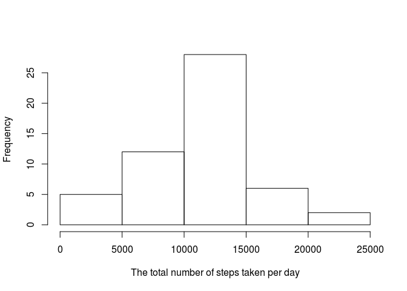
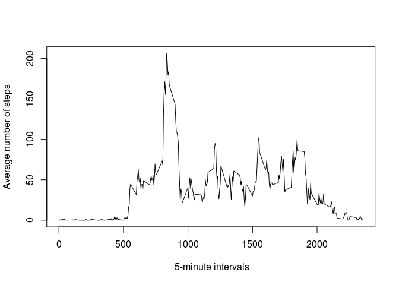
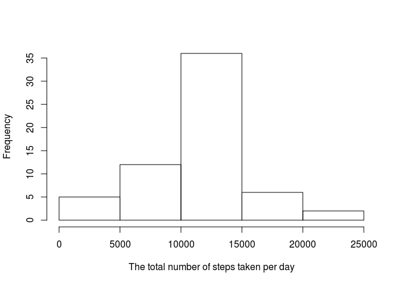
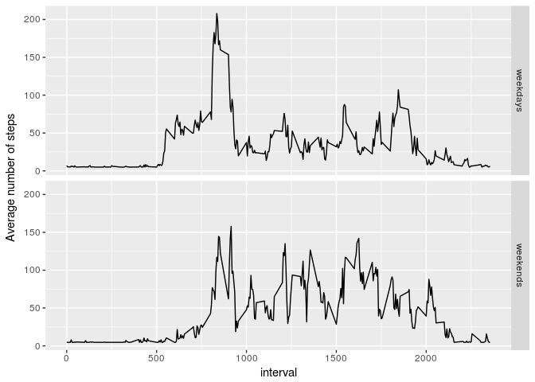

# Reproducible Research: Peer Assessment 1


## Loading and preprocessing the data


```r
data <- read.csv("activity.csv")
```

Load essential libraries

```r
library(dplyr)
```

```
## 
## Attaching package: 'dplyr'
```

```
## The following objects are masked from 'package:stats':
## 
##     filter, lag
```

```
## The following objects are masked from 'package:base':
## 
##     intersect, setdiff, setequal, union
```

```r
library(ggplot2)
library(stringr)
```


## What is mean total number of steps taken per day?
Get total number of steps per day

```r
total_per_day <- data %>% group_by(date) %>% summarize(ttl_steps=sum(steps))
```

Plot the histogram

```r
hist(total_per_day$ttl_steps, main = NULL, xlab = "The total number of steps taken per day")
```

<!-- -->

The mean number of steps taken per day:  

```r
mean(total_per_day$ttl_steps, na.rm = TRUE)
```

```
## [1] 10766.19
```

The median of number of steps taken per day:  

```r
median(total_per_day$ttl_steps, na.rm = TRUE)
```

```
## [1] 10765
```


## What is the average daily activity pattern?

```r
interval_aver_day <- data %>% group_by(interval) %>% summarise(aver_intrv = mean(steps, na.rm = TRUE))
plot(interval_aver_day$interval, interval_aver_day$aver_intrv, type = "l", xlab = " 5-minute intervals", ylab = "Average number of steps")
```

<!-- -->

The 5-minute interval on average across all the days in dataset containing  the maximum number of steps is 

```r
interval_aver_day$interval[which.max(interval_aver_day$aver_intrv)]
```

```
## [1] 835
```


## Imputing missing values

The total number of missing values:  

```r
data_na <- is.na(data)
sum(data_na)
```

```
## [1] 2304
```

Replace NAs with mean of the all 5-minute intervals (the approach is taken from Tyler Rinker: https://stackoverflow.com/users/1000343/tyler-rinker

```r
impute.mean <- function(x) replace(x, is.na(x), mean(x, na.rm = TRUE))
data <- data %>% mutate(steps = impute.mean(steps))
```

Get total number of steps per day

```r
total_per_day <- data %>% group_by(date) %>% summarize(ttl_steps=sum(steps))
```

Plot the histogram

```r
hist(total_per_day$ttl_steps, main = NULL, xlab = "The total number of steps taken per day")
```

<!-- -->


The mean number of steps taken per day after the imputing procedure:

```r
mean(total_per_day$ttl_steps, na.rm = TRUE)
```

```
## [1] 10766.19
```

The median number of steps taken per day after the imputing procedure:

```r
median(total_per_day$ttl_steps, na.rm = TRUE)
```

```
## [1] 10766.19
```

## Are there differences in activity patterns between weekdays and weekends?

```r
data <- data %>% mutate(weekdays = weekdays(as.Date(date, "%Y-%m-%d")))
data$weekdays <- str_replace(data$weekdays, "Monday|Tuesday|Wednesday|Thursday|Friday", "weekdays")
data$weekdays <- str_replace(data$weekdays, "Saturday|Sunday", "weekends")
data$weekdays <- as.factor(data$weekdays)
data.week.pattn <- data %>% group_by(weekdays,interval) %>% summarise(av_act_weekdays = mean(steps))
ggplot(data.week.pattn, aes(interval, av_act_weekdays)) + geom_line() + ylab("Average number of steps") + facet_grid(weekdays ~ .)
```

<!-- -->
